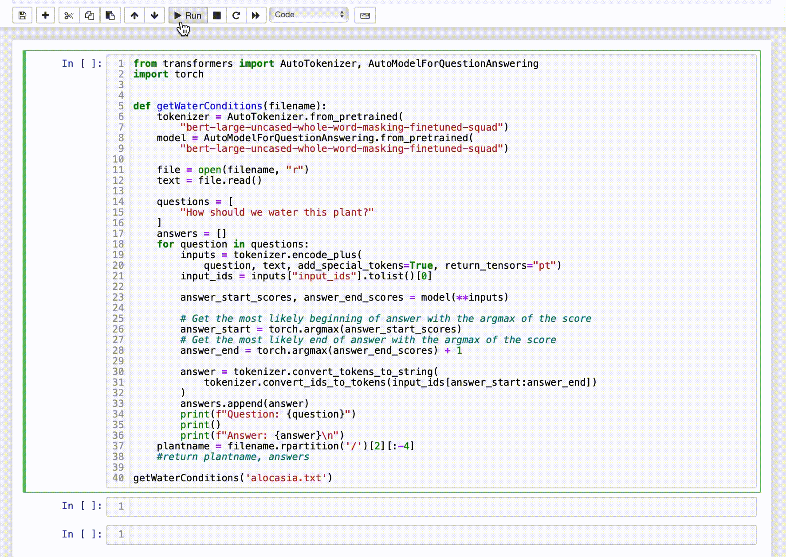

# plantParent


## About This Project

This project was inspired by my journey learning how to take care of multiple species of plants and not being able to find a resource to answer basic and common questions on how to care for these plants. Many websites have too many ads or too much content to sift through, so this is designed to take in the blocks of text that are provided on these sites and extract only the most necessary information. I have hardcoded some questions for the 4 aspects of plant care, sunlight conditions, watering schedule, how the soil should be kept, and common issues (i.e. are they more susceptible to wilting from overwatering or underwatering? common infestations? can they get too much light?)

## How It Works

This project utilizes the HuggingFace tranformers question and answering pipeline in order to take in a block of text and extract the phrases that feature key words that are also in the question. In this early stage, it only needs files with longform text about each species of plant (and hopefully later this could be automated to be webscraped to get more plant species and more recent data). 

## Getting Started

Clone this repo and install necessary requirements with 

```
pip install -r requirements.txt
```

And you can run each file by using, for example:
```
python plant_sun.py [file1]
```
And example files for you to use can be found in the care_files/ folder.

Find the full documentation here: https://plantparent.readthedocs.io/en/latest/

## Demo



## To Be Implemented

* Webscraping information and saving it into text files for multiple species of plants
* Finetuning the question and answering pipeline to get longer answers or extract answers from multiple places in the text
* Allowing a timer to be set in order to keep track of watering schedule (?)


### About The Author

Feel free to look at my other projects or peruse my website: https://aryndavis.github.io
